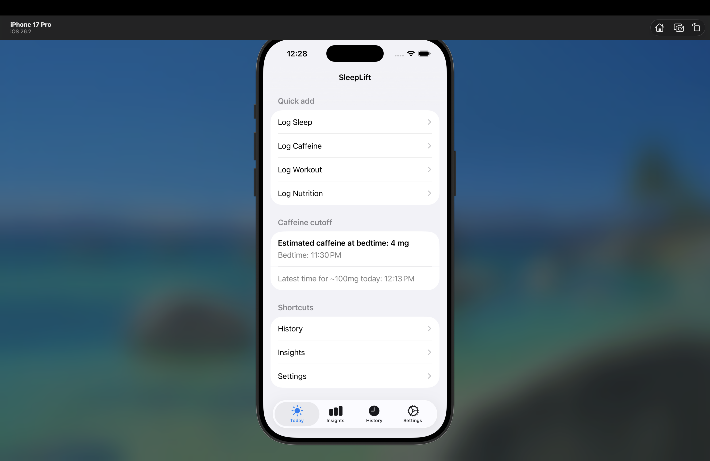
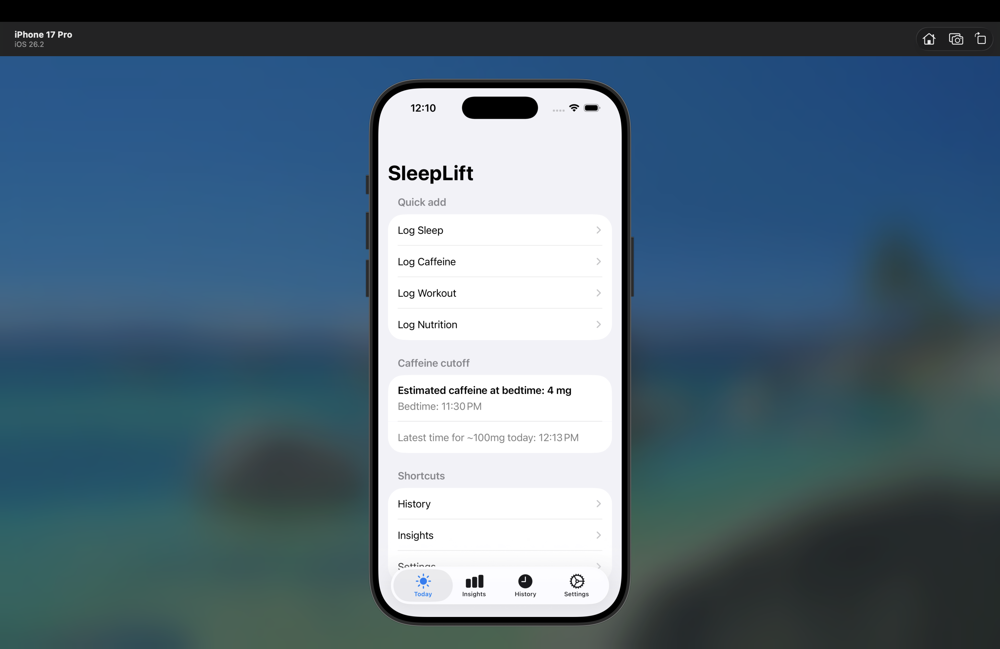
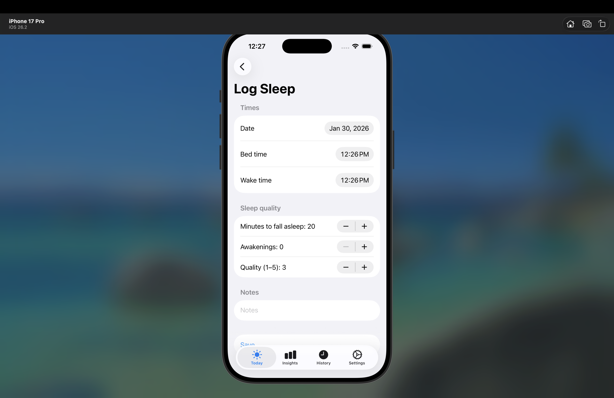
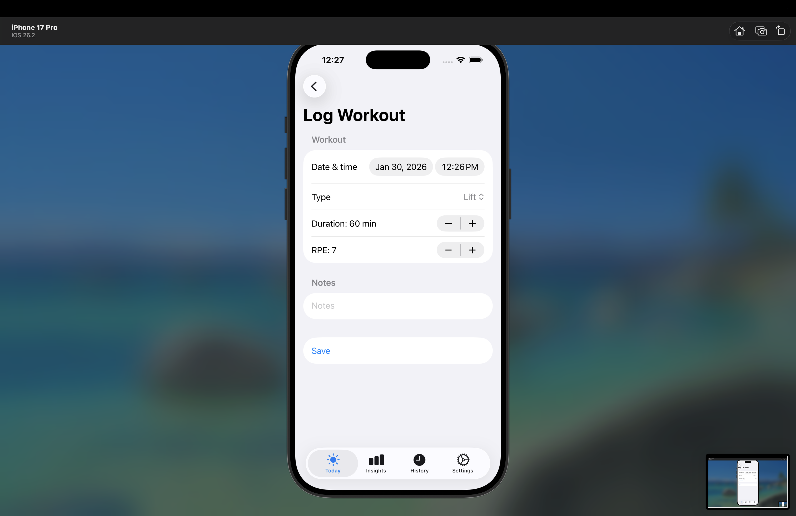
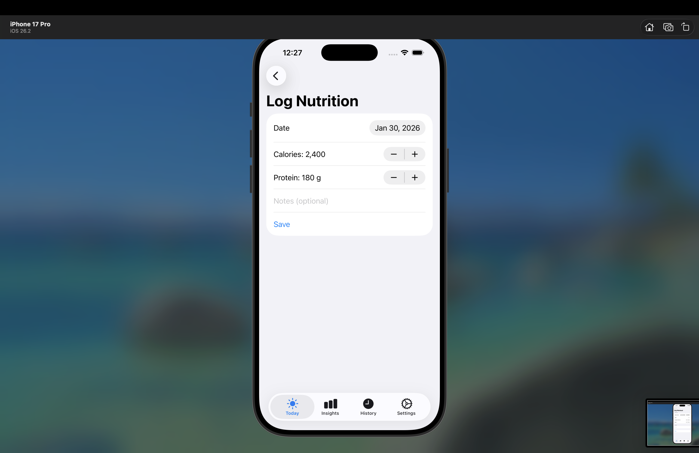
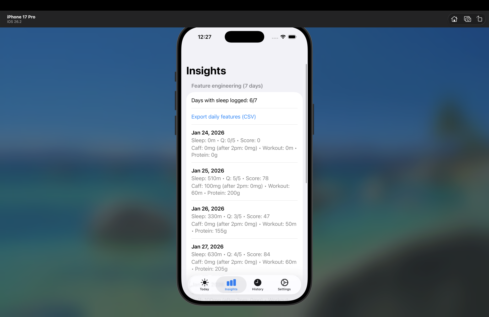
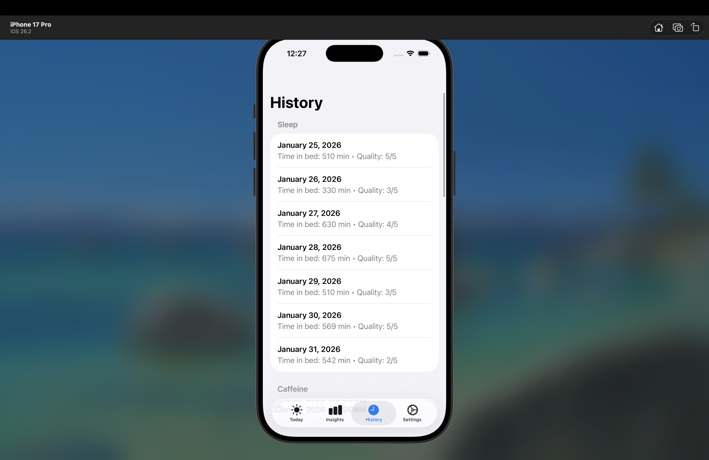

# SleepLift (iOS)

SleepLift is a lightweight iOS app I built in Swift to log daily habits that affect performance and sleep — sleep timing/quality, caffeine, workouts, and nutrition — and export the data as CSV for analysis.

I originally made this for myself because I work out consistently and wanted one place to track:
- protein/calories
- caffeine timing (to avoid sleep disruption)
- sleep quality
- training duration / effort

This repo is the iOS app.  
Companion data engineering repo: **SleepLift-DE** (CSV → Bronze/Silver/Gold → daily feature mart + dashboard).

---

## Features

### Quick logging (one tap → log)
- **Log Sleep**: bedtime/wake time, minutes to fall asleep, awakenings, quality (1–5), notes
- **Log Caffeine**: time, source, caffeine amount (mg)
- **Log Workout**: time, type, duration, RPE, notes
- **Log Nutrition**: date, calories, protein, optional notes

### Insights
- Simple weekly view of adherence/coverage (e.g., “days with sleep logged”)
- Daily summary rows for recent days (sleep + caffeine + workout + protein)
- **Export daily features (CSV)** from the Insights screen

### History
- Browse your past logs by category (sleep/caffeine/workout/nutrition)

### Settings + Export
- Edit profile
- **Export CSV** for raw logs (designed to feed the SleepLift-DE pipeline)

### Caffeine cutoff helper
- Shows an estimate of caffeine remaining at bedtime and a suggested “latest time” for ~100mg (based on a simple on-device estimate).

---

## Screenshots

**Overview**

**Quick Add Categories**

**Log Screens**

**Insights + Export**

**History**

**CSV Export**

> Note: All screenshots are stored in `docs/images/`.

---

## Data & Privacy

- All data is stored locally on-device (no backend server).
- CSV export is manual and happens only when the user taps Export.
- The app repo does **not** include any personal CSV exports in version control.

---

## CSV Export Format (high-level)

The app exports separate CSVs for each category (sleep/caffeine/workout/nutrition) and an optional “daily features” export from Insights.

These exports are designed to be consumed by the companion project:
**SleepLift-DE** — a batch ELT pipeline that ingests the raw CSVs and produces a daily-grain feature mart.

---

## How to Run

1. Clone this repo
2. Open the project in **Xcode**
3. Select an iOS Simulator (or your device)
4. Build + Run

---

## Project Structure (example)

- `Models/` – data models for sleep/caffeine/workout/nutrition
- `Views/` – SwiftUI screens (Log flows, Insights, History, Settings)
- `Export/` – CSV export helpers (file creation + share sheet)

(Your folder names may differ — this is just the logical layout.)

---

## Why I Built This

I wanted a fast, low-friction way to track the habits that actually move my sleep and training:
sleep quality, caffeine timing, workout intensity, and hitting my protein/calorie targets — and then analyze it later from exported CSVs.

---

## Future Improvements

- More insight metrics (rolling averages, trendlines)
- Stronger caffeine model customization (half-life settings, bedtime schedule)
- Better charts in-app (weekly sleep vs caffeine timing, etc.)
- Optional cloud sync (still privacy-first)

---

## Related Project

- **SleepLift-DE** (Data Engineering): CSV exports → Bronze/Silver/Gold ELT → daily feature mart + dashboard + CI
