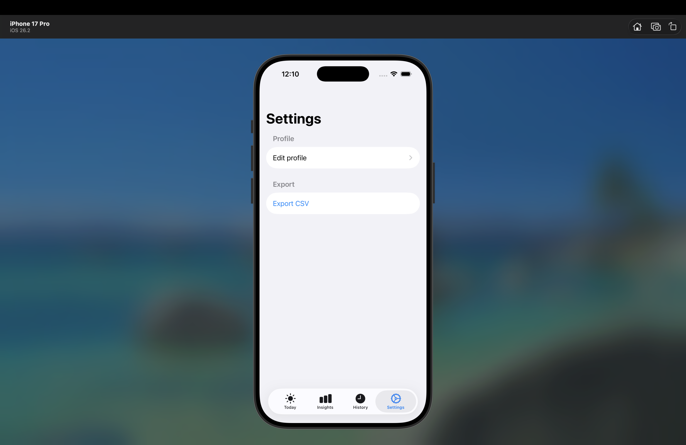
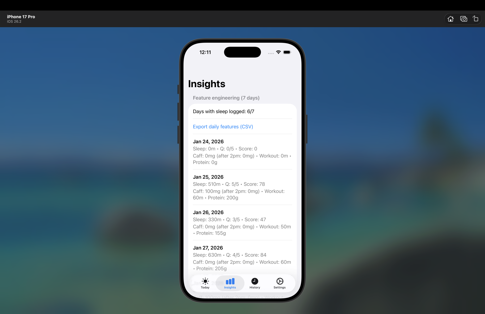

# SleepLift (iOS)

Swift iOS app built in Xcode to log sleep, caffeine, workouts, and nutrition, and export logs to CSV.

## What it does
- Log daily sleep minutes
- Log caffeine (mg + timestamp)
- Log workout minutes
- Log nutrition (calories + protein)
- Export CSV files for downstream analytics

## Screenshots

## Data pipeline
These CSV exports are consumed by my data engineering repo:
SleepLift-DE (Python + DuckDB ELT): https://github.com/jeffreylin0217/sleeplift-de
